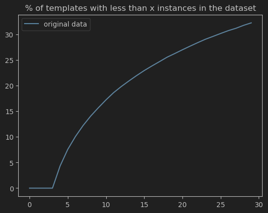
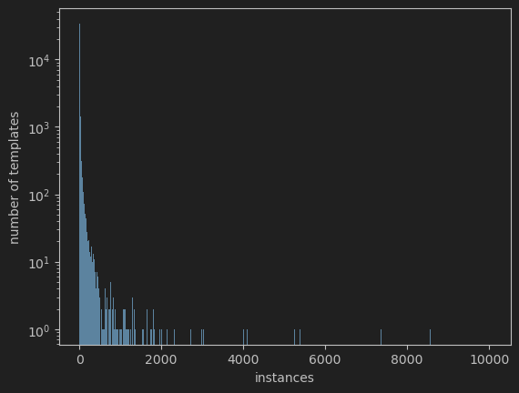
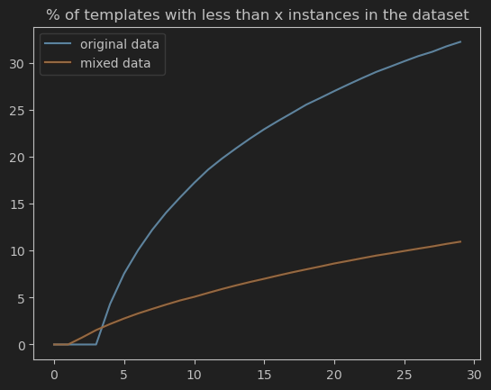
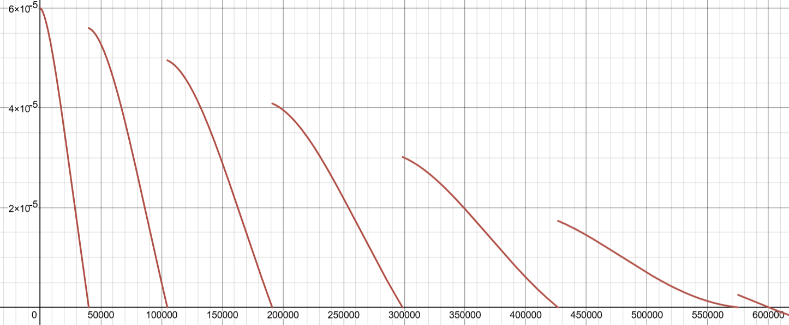

## TL;DR

Under [Tristan Cazenave](https://www.lamsade.dauphine.fr/~cazenave/index.php) supervision I improved the neural network behind AstraZeneca's retrosynthesis tool [Aizynthfinder](https://github.com/MolecularAI/aizynthfinder) by fixing class imbalances in the training dataset using large amount of synthetic data. I also tried to improve the model architecture and had promising results in training but did not have the time to translate those to better performances when used in conjonction with Monte Carlo tree search. 

## Introduction:

The goal of this internship was to get a better neural network for AstraZenecca's Aizynthfinder. Aizynthfinder is a retrosynthesis tool meaning it gives you the possible ways you could successively combine available or cheap precursors in order to get a target molecule. The results are given as trees, where the leaves are irreducible molecules and the root is the target molecules. A successful decomposition is one where all leaves are availables or cheap to get. 
The neural network is used to guide a Monte Carlo tree search by providing likely decompositions of a molecule into smaller parts.

To train the new model I used [Aizynthtrain](https://github.com/MolecularAI/aizynthtrain/tree/main). A collection of routines, pipelines and configurations for the training of Aizynthfinder's models (This markdown includes code snippets from the two Aizynthtrain's files I modified the most) . The models are trained on a library of known reaction templates (A template essentially captures the gist of a reaction, leaving the non interacting parts as variables) extracted from the US Patent Office (USPTO) dataset. 

### The main problem :

Initially, my colleague (a final-year graduate student student) and I thought it would be easy to obtain better prediction results as the model used was a simple MLP with one hidden layer and L2 regularization. We quickly realized that even with more complex architecture achieving a better score on the training data was challenging. Investigating deeper we discovered that the original dataset was very imbalanced. Below are a few visualizations of this problem :






### How I solved it :

To address this issue I focused on obtaining a more balanced dataset while my colleague concentrated on improving the model's architecture.  

Due to the relative scarcity of public reaction datasets I had the idea of generating synthetic data using Aizynthfinder itself. Indeed, at its core, a retro-synthesis tool gives a list of reactions to get the target molecules from convenient precursors.  

I had to first scrape a large list of SMILES (Simplified Molecular Input Line Entry System, a writing of molecules in characters, CC(=O)NCCC1=CNc2c1cc(OC)cc2 being melatonin for instance) to run Aizynthfinder on. To achieve this I set up a simple python script to scrape all the SMILES of expensive or unavailable molecules (the type that we would want to decompose in convenient precursors) from the ZINC20 database. 

From the ~4 millions SMILES I collected I randomly selected half a million and partitioned them in 64 packets to be processed each in parallel by aizynthfinder. This process was very compute heavy and took multiple days on the university's servers. 

After obtaining all the trees from those processes I then extracted reactions from successful decompositions meaning the ones yielding convenient precursors. I took this choice in order to bias the model to use decompositions which were actually successful. 

Finally I mixed the original and synthetic dataset. This improved the repartition without any further selection. I suspect this is due to the exploration element of MCTS finding examples where underrepresented templates perform well, resulting in a more balanced dataset.  




### Improvements:

To test and compare the effectiveness of new models we used me and my colleague this [benchmark](https://zenodo.org/records/6511731) of 60 complex molecules. I also created my own benchmark of 100 less complex molecules that were not in the SMILES used to generate synthetic data. 

Training the original architecture on the new dataset resulted in no increase in the number of molecules solved but a substantial reduction in time. It also found more valid ways to obtain the molecules which is positive. 

|                                  | Mixed Data | Natural Data |
| -------------------------------- | ---------- | ------------ |
| **Benchmark 100 molecules:**     |            |              |
| Number resolved                  | 56         | 56           |
| Total time                       | 1955 s     | 3004 s       |
| Average time to first resolution | 1.23 s     | 2.69 s       |
| Number of unique trees found     | 878        | 727          |
|                                  |            |              |
| **Benchmark 60 molecules:**      |            |              |
| Number resolved                  | 28         | 28           |
| Total time                       | 16935 s    | 16484 s      |
| Average time to first resolution | 10.35 s    | 101.64 s     |
| Number of unique trees found     | 1216       | 707          |

I hypothesized that this lack of improvement was due to the fact that the model already knows how to perform well represented decompositions. Adding new synthetic data using those same decompositions only reduce its accuracy as synthetic data is inferior to natural one. Therefore I decided of a cutoff where I would not add synthetic decompositions to the dataset if they already have more than 30 instances in the original dataset. 

This gave me a model who could solve more molecules. Unfortunately we lose a significant portion of the speed advantage. 

|                               | Filtered Mixed Data 30 | Natural Data         |
|-------------------------------|-----------------------|----------------------|
| **Benchmark 100 molecules:**   |                       |                      |
| Number resolved                | 62                    | 56                   |
| Total time                     | 2246 s                | 3004 s               |
| Average time to first resolution | 1.95 s               | 2.69 s               |
| Number of unique trees found   | 853                   | 727                  |
|                               |                       |                      |
| **Benchmark 60 molecules:**    |                       |                      |
| Number resolved                | 31                    | 28                   |
| Total time                     | 17041 s               | 16484 s              |
| Average time to first resolution | 108.67 s             | 101.64 s             |
| Number of unique trees found   | 805                   | 707                  |


### Further work

Having a more balanced dataset I went back to the original task of finding better model architectures. At first I tried to modify the way Aizynthtrain generates fingerprints which are binary arrays of fixed size where each bit represents the presence of a specific substructure within the molecule. I experimented with higher radius (which controls the size of the molecular substructure being encoded) as well as higher length (the number of bits used to represent the possible substructures) which would in theory allow the neural network to access more information about the molecule. The results I obtained were inconsistent with no clear effect on performance so I decided to leave it as is and move on.  

After this foray into fingerprints I decided to implement a transformer architecture. My idea was that the attention mechanism was a natural way to capture the relationships between the different molecular substructures. 
However the inputs were 2048 bit long, this context length meant that I was regularly getting Out Of Memory errors with the attention tensor. To reduce context length I initially grouped the bits into numbers, trading smaller context length for a larger embedding matrix. However reducing context length too much caused the embedding matrix to grow exponentially which made the model unable to learn. 
Therefore I switched to a Feed Forward network with input of size 2048 and output of size $d\_model\times sequence\_length$ whose output I reshaped into $d\_model,sequence\_length$. This choice gave me full control of the context length and better performance compared to the previous approach. 

A second way I reduced memory usage and inference time was throught the use of a projection of the input on the dimensions $k \times d\_model$ instead of  $n \times d\_model$ where $n > k$ before passing it to compute the key and value matrix in the multihead attention operation. 

*(from the training.py file)*

````python
class BaseAttention(Layer):  
    def __init__(self,*,dropout,num_word,k,**kwargs):  
        super().__init__()  
        self.mha = MultiHeadAttention(dropout=dropout ,**kwargs)  
        self.add = Add()  
        self.proj = tf.Variable(initial_value=tf.random.normal(shape=(k,num_word),mean=0.0,stddev=0.2),trainable=True)  
  
  
class LinAttention(BaseAttention):  
  
    def __init__(self, **kwargs):  
        super().__init__(**kwargs)  
  
    @tf.function  
    def call(self,x):  
        x_proj = tf.matmul(self.proj,x)  
        attn_output = self.mha(  
            query = x,  
            value = x_proj,  
            key = x_proj  
        )  
        x = self.add([x,attn_output])  
        return x

````

This change was inspired by the [Linformer](https://arxiv.org/pdf/2006.04768) paper where they demonstrated that self attention can be well approximated by projecting the key and value matrix onto a space of lower dimension. 

To train the model I switched to adam with weight decay. I also wanted to use cosine decay with warm restart but Tensorflow 2.8 does not support it so I reimplemented an approximation. 

*(from the keras_utils.py file)*

````python 
class WarmUpLearningRateScheduler(LearningRateSchedule):  
  
    def __init__(self,init_lr,target_lr,warmup_steps,warmup_target,alpha,decay_steps,total_step_number):  
        super().__init__()  
        self.init_lr = init_lr  
        self.target_lr = target_lr  
        self.warmup_steps = warmup_steps  
        self.alpha = alpha  
        self.decay_steps = decay_steps  
        self.warmup_target = warmup_target  
        self.total_step_number = total_step_number  
    @tf.function  
    def __call__(self, step):  
        step = tf.cast(step, tf.float32)  
        warmup_lr = self.init_lr + (self.warmup_target - self.init_lr) * (step / self.warmup_steps)  
        if step < self.warmup_steps:  
            return warmup_lr  
        else:  
  
            global_decay = (-1/self.total_step_number)*step + 1   
              
			frac = (step / (self.decay_steps*2+200*tf.math.sqrt(step))) % 0.5  
            cosine_decay = tf.cos(tf.constant(np.pi) * frac)  
            cyclical_decay = (1 - self.alpha) * cosine_decay + self.alpha  
  
            lr = self.target_lr * cyclical_decay * global_decay  
            return lr		
````

with the parameter value I used for training the model this gives us (ignoring the linear warm up): 

$\left(6e-5\right)\left(\cos\left(\pi\mod\left(\frac{x}{40000+200\sqrt{x}},0.5\right)\right)\right)\left(-\frac{1}{6\cdot10^{5}}x+1\right)$

where $x$ is the number of steps

which in practice gives :




Using this learning rate scheduler coupled with an initial warm up led to faster convergence in training compared to the original method of reducing the learning rate when plateauing. 

After tuning of the hyperparameters I achieved better performances during training (on the mixed dataset) using this model over the original. 

|                                  | Mini LinFormer | Basic Architecture |
| -------------------------------- | -------------- | ------------------ |
| **Training Metrics:**            |                |                    |
| Train_loss                       | 0.75           | 1.39               |
| Val_loss                         | 2.75           | 3.36               |
| Val_acc                          | 0.48           | 0.44               |
| Val_top10_acc                    | 0.81           | 0.78               |
| Val_top50_acc                    | 0.90           | 0.89               |
|                                  |                |                    |
| **Benchmark 100 molecules:**     |                |                    |
| Number resolved                  | 62             | 63                 |
| Total time                       | 2578 s         | 2553 s             |
| Average time to first resolution | 12.82 s        | 10.65 s            |
| Number of unique trees found     | 793            | 873                |
|                                  |                |                    |
| **Benchmark 60 molecules:**      |                |                    |
| Number resolved                  | 30             | 31                 |
| Total time                       | 15,421 s       | 16,544 s           |
| Average time to first resolution | 65.23 s        | 33.77 s            |
| Number of unique trees found     | 754            | 823                |
| Number of nodes in the MCTS tree | 300,422        | 424,440            |

Unfortunately this model solves less molecules than the original one. The set of solved molecules is not exactly the same but still the better results in training do not translate in application within aizynthfinder. This , I think, is caused by the greater inference time of the more complex model. As we can see in the 60 molecules benchmark there are over 25% less call to the policy. However my internship was coming to an end and I had to call it quit. 

### What I learned :

In fact what I spent most of my time on was not the work mentionned above. Understanding and getting someone else's code to run was actually the most time consuming part of my internship. This was my first time interacting with industry level code as opposed to the simpler algorithms we see in school. I believe this has made me a better programmer. This also was my first research experience and overall a positive one. I really appreciated its openness. Feeling like there are no "right" way to approach a problem but a multitude of different paths. 